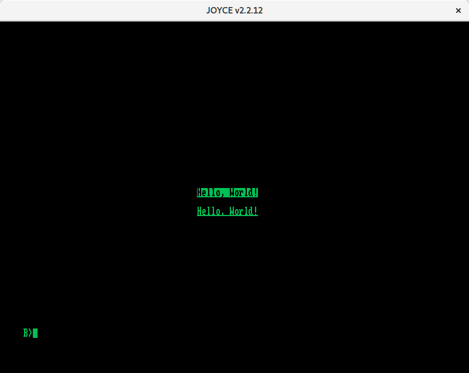
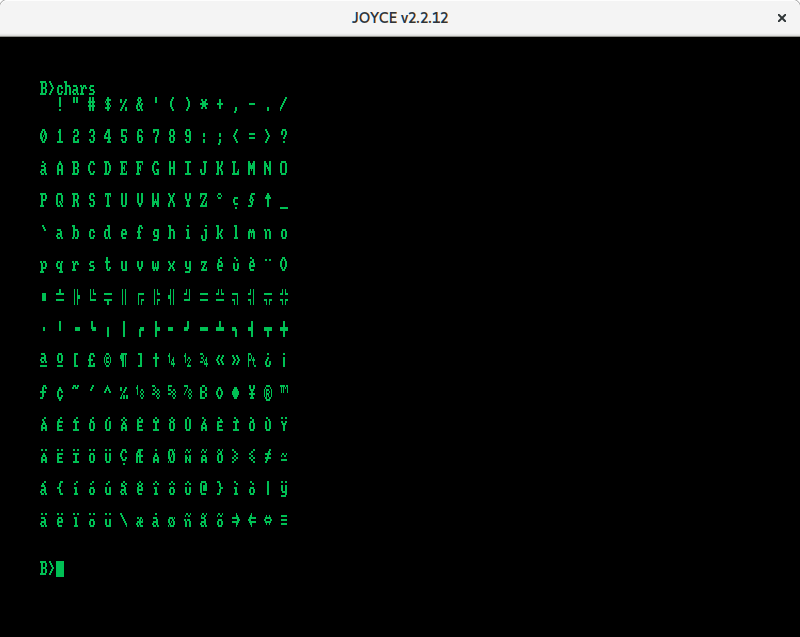

How to use Z88DK for the Amstrad PCW
=====================================

Installation of Z88DK
---------------------

First, download the `z88dk-src-v199A-RC.tgz` archive from
.

Uncompress it and enter the directory.

Set correct permission on scripts:

    chmod 755 *.sh

Edit the `Makefile` file and change the following line:

    DEFAULT = z88

to:

    DEFAULT = cpm

Build:

    ./build.sh
    sudo make install
    sudo ln -s /usr/local/share/z88dk /usr/local/lib/z88dk
    make libs
    sudo make install-libs

You now have a working copy of a small C cross compiler.

Compiling the examples
----------------------

The `hello.c` and `chars.c` files can be compiled with the following commands:

    zcc -o hello.com hello.c
    zcc -o chars.com chars.c

You can test `hello.com` and `chars.com` on a real Amstrad PCW or on the Joyce
emulator by John Elliott.

Notes
-----

You can read the following lines in the examples:

    #pragma output nostreams
    #pragma output nofileio
    #pragma output noprotectmsdos
    #pragma output noredir
    #pragma output nogfxglobals

They allows to reduce the executable file size.
